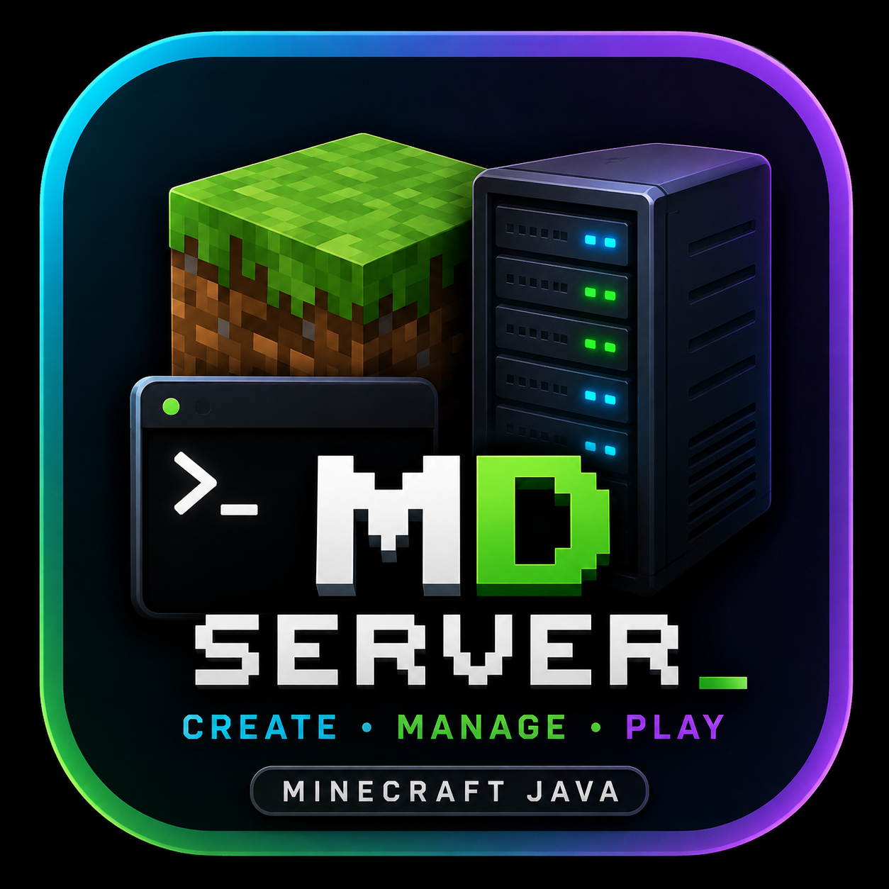

<div align="center">




[](https://termux.dev)
[](https://adoptium.net)
[](LICENSE)

<br/>

```
 ███╗   ███╗██████╗   ███████╗███████╗██████╗ ██╗   ██╗███████╗██████╗
 ████╗ ████║██╔══██╗  ██╔════╝██╔════╝██╔══██╗██║   ██║██╔════╝██╔══██╗
 ██╔████╔██║██║  ██║  ███████╗█████╗  ██████╔╝██║   ██║█████╗  ██████╔╝
 ██║╚██╔╝██║██║  ██║  ╚════██║██╔══╝  ██╔══██╗██║   ██║██╔══╝  ██╔══██╗
 ██║ ╚═╝ ██║██████╔╝  ███████║███████╗██║  ██║╚██████╔╝███████╗██║  ██║
 ╚═╝     ╚═╝╚═════╝   ╚══════╝╚══════╝╚═╝  ╚═╝ ╚═════╝ ╚══════╝╚═╝  ╚═╝
```

**Crea y gestiona servidores de Minecraft Java en Android con Termux — sin root, sin complicaciones.**
**Create and manage Minecraft Java servers on Android using Termux — no root, no hassle.**

</div>

---

## ¿Qué es MD Server?

**MD Server** es un gestor de servidores de **Minecraft Java** diseñado para dispositivos **Android** que ejecutan **Termux**. Te permite crear, configurar y administrar servidores de Minecraft completos directamente desde la terminal de tu teléfono, sin necesidad de root ni conocimientos técnicos avanzados.

**MD Server** is a **Minecraft Java server manager** built for **Android** devices running **Termux**. It lets you create, configure, and administer full Minecraft Java servers right from your phone's terminal — no root required and no advanced technical knowledge needed.

---

## 📥 Instalación rápida | Quick install

Copia **una** de estas líneas en Termux y pulsa Enter (**este es el código que pegarás en Termux** / **this is the code you paste in Termux**):

**Método 1 — un solo comando (recomendado / recommended):**

```bash
curl -fsSL https://raw.githubusercontent.com/jephersonRD/MD-Server/main/install.sh | bash
```

**Método 2 — desde GitHub:**

```bash
pkg update -y && pkg install -y git python && cd ~ && if [ -d MD-Server/.git ]; then cd MD-Server && git pull --ff-only; else git clone --depth 1 https://github.com/jephersonRD/MD-Server.git && cd MD-Server; fi && bash install.sh
```

> ⚠️ El instalador es **reutilizable y seguro**: puedes ejecutarlo todas las veces que quieras. Detecta si es la primera instalación, si ya tienes una versión antigua o nueva, si faltan dependencias o si una instalación quedó a medias, y lo resuelve automáticamente **sin borrar nunca tus servidores, mundos, mods ni ajustes** (esos viven en `~/mdserver/`, no en la carpeta del código).

> ℹ️ La primera vez te preguntará el idioma y guía todo el proceso. Al abrir MD Server verás el menú principal: **[1] Crear servidor**, **[2] Mis servidores**, **[3] Configuración**, **[4] Salir**.
> ℹ️ On first use it asks for your language and guides you through the entire process. When you open MD Server you'll see the main menu: **[1] Create Server**, **[2] My Servers**, **[3] Settings**, **[4] Exit**.

---

## 📋 Requisitos | Requirements

- 📱 Dispositivo **Android** (recomendado 4 GB+ de RAM) o cualquier sistema Linux/POSIX.
- 🧪 **Termux** (desde F-Droid o GitHub) y permisos de almacenamiento.
- 🌐 Conexión a Internet (al menos al crear el servidor).

*MD Server instala automáticamente lo que falte (Python, paquetes y Java).*

---

## ▶️ Abrir MD Server | Open MD Server

**`mdserver` es el comando global** que abre MD Server desde **cualquier directorio** de Termux.

```bash
mdserver
```

### 🎬 Video demo

https://github.com/user-attachments/assets/f5a6d90a-371e-444c-8564-79badca4d16c

Ejemplos:

```bash
cd ~
mdserver
```

```bash
cd ~/storage/downloads
mdserver
```

> No necesitas entrar manualmente a la carpeta `MD-Server` ni recordar rutas: escribe `mdserver` y listo.

### 🤖 Instalación automática
- Si la carpeta `MD-Server` **no existe**, se clona desde GitHub.
- Si ya existe un repo Git, se **actualiza** automáticamente.
- Si la carpeta está dañada o no es MD Server, se **respalda** (`MD-Server.old-FECHA`) y se instala de nuevo — nunca borra datos sin avisar.
- Si **faltan dependencias** (git, Python, rich, requests), las instala.
- Si una **instalación quedó a medias**, se repara en la siguiente ejecución.
- Las descargas se comprueban y el proceso se puede volver a ejecutar aunque hubo un error de red.

---

## 🖥️ Gestión de servidores | Server management

Al abrir MD Server verás el menú principal:

```
[1] Crear servidor
[2] Mis servidores
[3] Configuración
[4] Salir
```

### Crear servidor de Minecraft

El asistente te guía paso a paso para crear un nuevo servidor:

- **Tipo de servidor**: Vanilla (activo), Fabric y Forge (próximamente).
- **Versión de Minecraft**: todas las versiones oficiales desde Mojang (1.7.10 hasta 1.21+).
- **RAM asignada**: recomendación automática basada en tu dispositivo.
- **Nombre personalizado** para identificar cada servidor.
- Descarga automática del JAR con verificación SHA-1.

### Gestionar servidores existentes

Con **[2] Mis servidores** puedes gestionar todos tus servidores desde una sola pantalla:

- Ver **todos los servidores** creados con su versión, tipo y estado (● ONLINE / ○ OFFLINE).
- **Iniciar / Detener / Reiniciar** cada servidor.
- **Consola** en vivo con comandos de Minecraft.
- **Información**: nombre, versión, tipo, estado, puerto, carpeta y (si está ONLINE) las direcciones local, LAN e Internet.
- **Configuración** del servidor (MOTD, jugadores, gamemode, dificultad, PvP, modo online).
- **Renombrar** el servidor sin tocar sus archivos internos.
- **Eliminar** con doble confirmación: se muestra exactamente qué se borrará y hay que escribir `ELIMINAR` para confirmar. Nunca borra otros servidores. Si el servidor está ONLINE, primero pide detenerlo.

Los servidores creados con versiones anteriores de MD Server se **detectan automáticamente** — no tienes que volver a crearlos. Todo vive en `~/mdserver/servers/`.

### Funciones adicionales

- **Monitor en tiempo real**: CPU, RAM, uptime y almacenamiento del servidor.
- **Gestión de mundos**: crear, importar, eliminar, respaldar y restaurar mundos.
- **Gestión de mods** (para servidores Fabric/Forge): listar, importar y eliminar mods.
- **Copias de seguridad**: respaldos manuales y automáticos con programación por intervalo.
- **Detección de jugadores**: paneles visuales de conexión y desconexión con IP.
- **Conexión**: detección automática de IP local y pública, soporte para Playit.gg y Tailscale.
- **Idioma**: soporte completo para español e inglés, cambiable en cualquier momento.

---

## 🗑️ Desinstalación | Uninstall

El código y el comando viven en rutas separadas de tus datos.

```bash
# Quitar el comando global y el código (Termux)
rm -f "$PREFIX/bin/mdserver"
rm -rf ~/MD-Server

# Quitar TODOS tus datos de servidores (mundos, mods, backups, ajustes)
rm -rf ~/mdserver
```
---

## 📶 Conexión | Connection

- **LAN:** jugadores en la misma red Wi-Fi se conectan a `IP_local:25565`.
- **Pública:** MD Server detecta tu IP pública, pero **si tu router usa CGNAT o el puerto no está abierto, no permitirá conexiones externas**.
- **Externa sin puertos:** desde la sección *Conexión externa* puedes instalar **Playit.gg** o **Tailscale** y compartir un enlace público con tus amigos.

---


## 🔒 Seguridad | Security

- Todas las descargas provienen de **fuentes oficiales** (Mojang `piston-meta`, `meta.fabricmc.net`, Maven de MinecraftForge) sobre **HTTPS**.
- Los servidores de Vanilla se verifican contra su **SHA-1** oficial.
- No se ejecutan scripts de Internet sin validación.
- Se pide **confirmación** antes de borrar o sobrescribir mundos, mods o servidores.

---

## ⚠️ Limitaciones reales | Real limitations

- **Los plugins** (Bukkit/Spigot/Paper) **no son compatibles** con Vanilla/Fabric/Forge; MD Server lo informa y no crea carpetas falsas.
- La conexión pública depende de tu red (CGNAT/puertos); MD Server lo explica sin prometer imposibles.
- El rendimiento depende del hardware del teléfono (la RAM y CPU determinan cuántos jugadores soportas).

---

## 🧪 Cómo está construido | Built with

- **Python 3** — portabilidad total en Termux.
- **Rich** — interfaz TUI profesional (paneles, tablas, barras de progreso, spinners).
- **Requests / urllib** — descargas robustas con reintentos.
- **OpenJDK** (Termux) — Java 21/17 según la versión de Minecraft.

---

<div align="center">

**Hecho para la comunidad · Made for the community** 🌍

⭐ Si te sirve, dale una estrella. | If this helped you, please star the repo.

</div>
